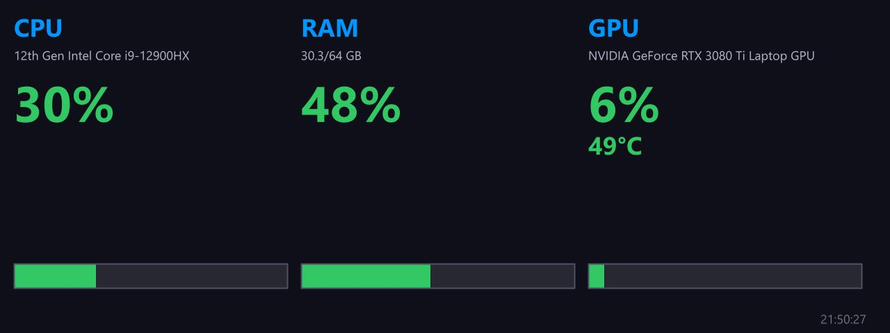

# Basic Info

**Panel ID:** `basic-info`
**Category:** System
**Plugin:** LCDPossible Core Panels
**Live Data:** Yes
**Animated:** No

Basic system information including hostname, OS, and uptime

## Overview

The Panel: basic-info provides critical system identification details such as computer hostname, operating system name and version alongside uptime metrics essential for monitoring device performance within an enterprise environment. This straightforward functionality serves to streamline operational management by delivering real-time insights into the hardware running applications like LCDPossible without additional dependencies across various platforms.

## Screenshot



## Details

Displays basic system identification:
- Computer hostname
- Operating system name and version
- System uptime
- Current date and time

No special dependencies required - works on all platforms.

## Examples

### Display basic system information

```bash
lcdpossible show basic-info
```

### Combine basic info with CPU usage in a slideshow

```bash
lcdpossible show basic-info,cpu-usage-graphic
```


## Profile Usage

### Add to Profile

```bash
# Add panel to default profile
lcdpossible profile append-panel basic-info

# Add with custom duration (30 seconds)
lcdpossible profile append-panel "basic-info|@duration=30"
```

### Quick Show

```bash
# Display panel immediately
lcdpossible show basic-info
```

---

*Generated by [LCDPossible](https://github.com/DevPossible/lcd-possible)*

