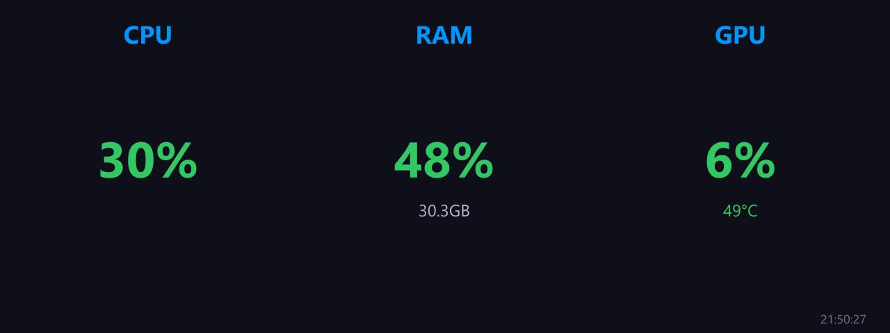

# Basic Usage Text

**Panel ID:** `basic-usage-text`
**Category:** System
**Plugin:** LCDPossible Core Panels
**Live Data:** Yes
**Animated:** No

Simple CPU/RAM/GPU usage summary

## Overview

The LCDPossible panel serves as an indispensable tool within system administration practices by providing administrators with a quick and comprehensive snapshot of crucial resource utilizations including CPU, RAM, and GPU percentages across the connected devices in their environment. Ideal for monitoring performance during peak operational hours or troubleshooting bottlenecks due to its real-time data presentation on one centralized interface, it stands out as an efficient solution that supports both proactive system optimization strategies and responsive reactions to unforeseen contingencies in enterprise settings.

## Screenshot



## Details

Shows a compact summary of system resource usage:
- CPU usage percentage
- RAM usage percentage
- GPU usage percentage

All values displayed on a single panel for quick overview.

## Dependencies

- LibreHardwareMonitorLib

## Examples

### Display combined CPU/RAM/GPU usage

```bash
lcdpossible show basic-usage-text
```


## Profile Usage

### Add to Profile

```bash
# Add panel to default profile
lcdpossible profile append-panel basic-usage-text

# Add with custom duration (30 seconds)
lcdpossible profile append-panel "basic-usage-text|@duration=30"
```

### Quick Show

```bash
# Display panel immediately
lcdpossible show basic-usage-text
```

---

*Generated by [LCDPossible](https://github.com/LCDPossible/LCDPossible)*

