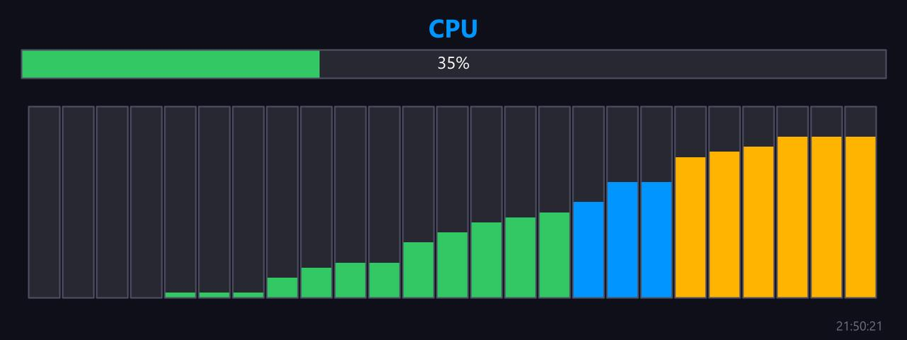

# CPU Usage Graphic

**Panel ID:** `cpu-usage-graphic`
**Category:** CPU
**Plugin:** LCDPossible Core Panels
**Live Data:** Yes
**Animated:** No

CPU usage with graphical bars including per-core breakdown

## Overview

The cpu-usage-graphic panel serves as an essential tool in evaluating and managing CPU utilization within computing environments by rendering visual progress bars that represent overall usage alongside a per-core breakdown. This facilitates quick assessments of workload distribution, identifies potential bottlenecks or imbalances across cores with color coding indicating operational efficiency, thereby enhancing the monitoring capabilities for multi-core systems crucial to enterprise operations.

## Screenshot



## Details

Displays CPU usage with visual progress bars:
- Overall CPU usage bar at the top
- Individual bars for each CPU core
- Percentage labels for each core
- Color-coded bars (green/yellow/red based on load)

Great for monitoring multi-core workloads.

## Dependencies

- LibreHardwareMonitorLib

## Examples

### Display CPU usage with graphical bars

```bash
lcdpossible show cpu-usage-graphic
```

### Update CPU bars every 2 seconds

```bash
lcdpossible show cpu-usage-graphic|@interval=2
```


## Profile Usage

### Add to Profile

```bash
# Add panel to default profile
lcdpossible profile append-panel cpu-usage-graphic

# Add with custom duration (30 seconds)
lcdpossible profile append-panel "cpu-usage-graphic|@duration=30"
```

### Quick Show

```bash
# Display panel immediately
lcdpossible show cpu-usage-graphic
```

---

*Generated by [LCDPossible](https://github.com/DevPossible/lcd-possible)*

