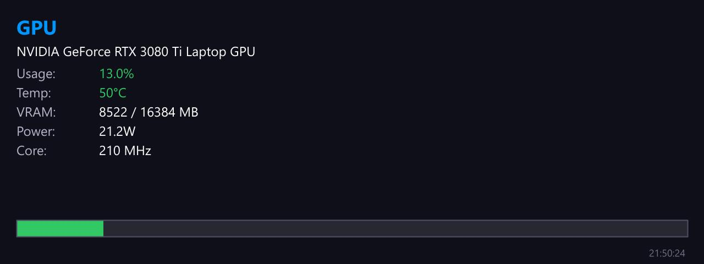

# GPU Info

**Panel ID:** `gpu-info`
**Category:** GPU
**Plugin:** LCDPossible Core Panels
**Live Data:** Yes
**Animated:** No

GPU information including model, usage, temperature, and VRAM

## Overview

The LCDPossible panel is designed to provide detailed information on various GPU parameters such as model name, core usage percentage, temperature, VRAM utilization (both used and total), clock speed, along with power consumption metrics when available. This application extends its utility across NVIDIA, AMD, and Intel graphics hardware through the integration of LibreHardwareMonitor technology, establishing itself as a vital tool for system administrators seeking to monitor and manage GPU resources effectively within enterprise environments.

## Screenshot



## Details

Displays comprehensive GPU information:
- GPU model name
- GPU core usage percentage
- GPU temperature
- VRAM usage (used/total)
- GPU clock speed
- Power consumption (if available)

Supports NVIDIA, AMD, and Intel GPUs via LibreHardwareMonitor.

## Dependencies

- LibreHardwareMonitorLib

## Examples

### Display GPU information

```bash
lcdpossible show gpu-info
```


## Profile Usage

### Add to Profile

```bash
# Add panel to default profile
lcdpossible profile add gpu-info

# Add with custom duration (30 seconds)
lcdpossible profile add "gpu-info|@duration=30"
```

### Quick Show

```bash
# Display panel immediately
lcdpossible show gpu-info
```

---

*Generated by [LCDPossible](https://github.com/DevPossible/lcd-possible)*

