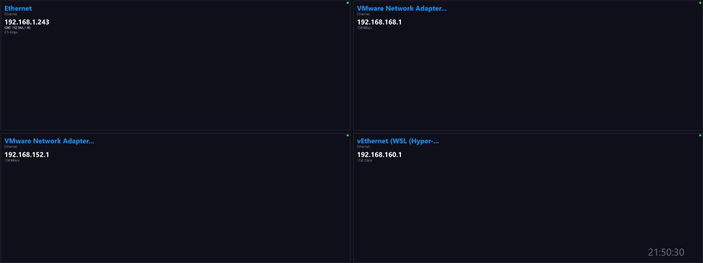

# Network Info

**Panel ID:** `network-info`
**Category:** Network
**Plugin:** LCDPossible Core Panels
**Live Data:** Yes
**Animated:** No

Network configuration including hostname, IP addresses, gateway, and DNS

## Overview

The Network Information panel within LCDPossible is engineered to streamline network configuration management by presenting users with detailed insights into their hostname, IP address assignments (including primary and secondary addresses), default gateway settings, DNS server particulars, as well as the active network adapter identification. Ideal for IT professionals seeking an efficient toolset that bolsters system security protocols through accurate documentation of network topology within enterprise environments without extraneous dependencies.

## Screenshot



## Details

Displays network configuration details:
- Hostname
- Primary IP address(es)
- Default gateway
- DNS servers
- Active network adapter name

Works on all platforms without additional dependencies.

## Examples

### Display network configuration

```bash
lcdpossible show network-info
```


## Profile Usage

### Add to Profile

```bash
# Add panel to default profile
lcdpossible profile append-panel network-info

# Add with custom duration (30 seconds)
lcdpossible profile append-panel "network-info|@duration=30"
```

### Quick Show

```bash
# Display panel immediately
lcdpossible show network-info
```

---

*Generated by [LCDPossible](https://github.com/DevPossible/lcd-possible)*

