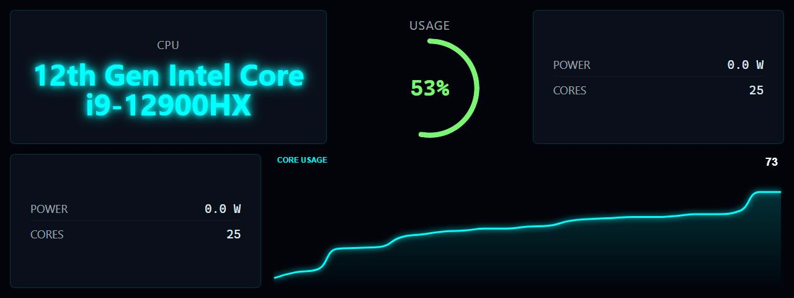
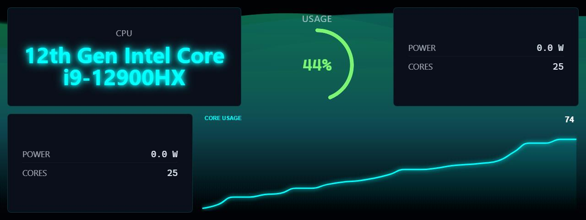
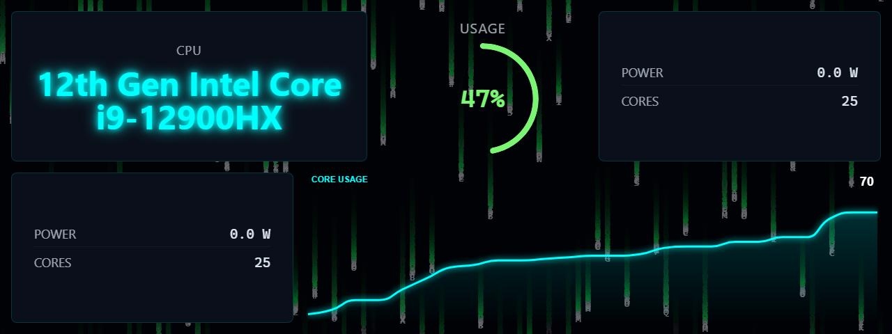
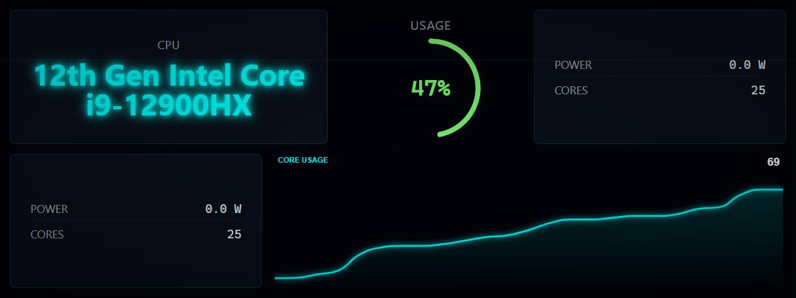
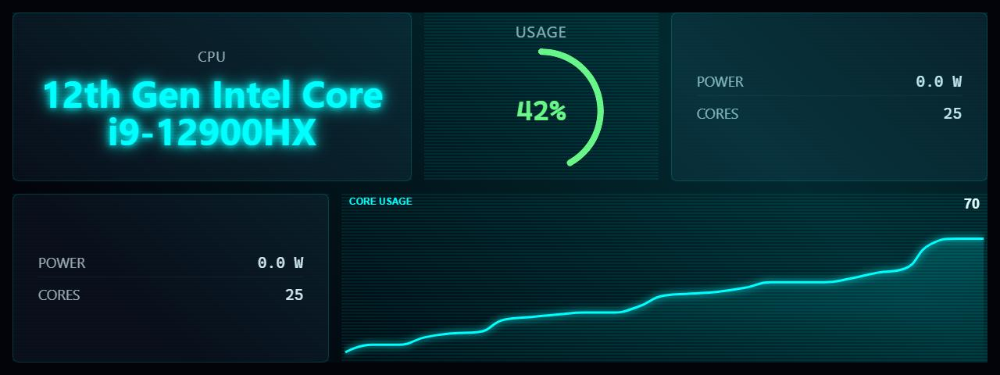
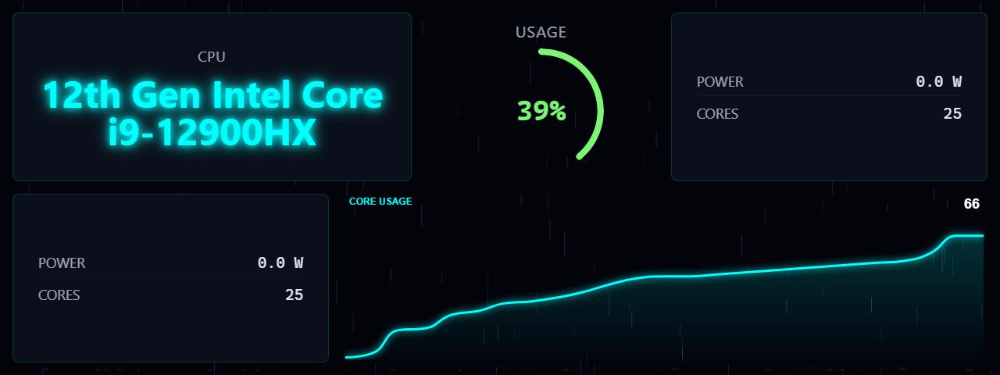
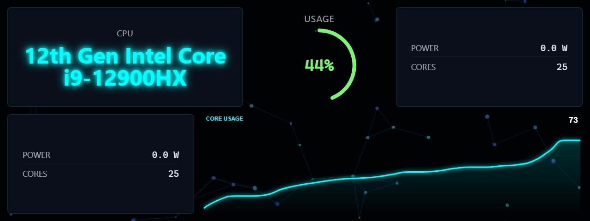
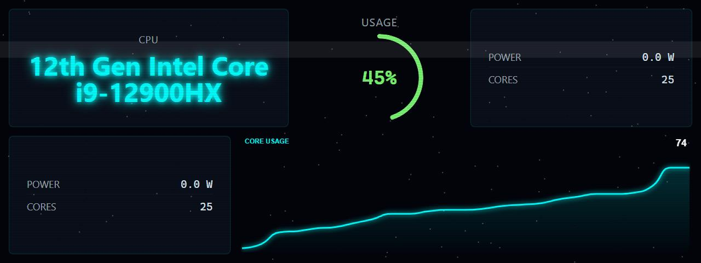
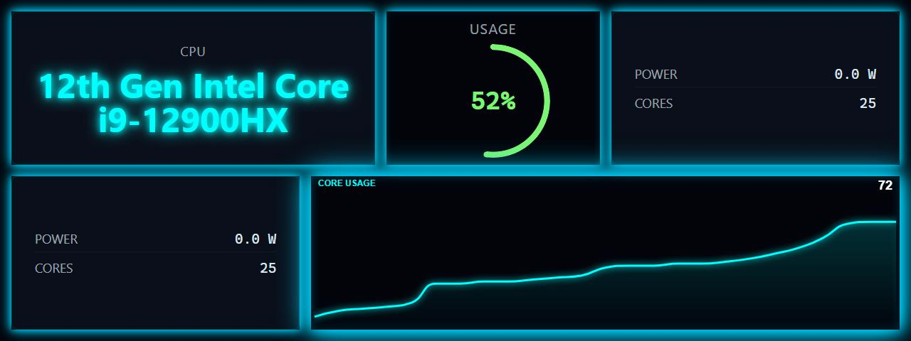
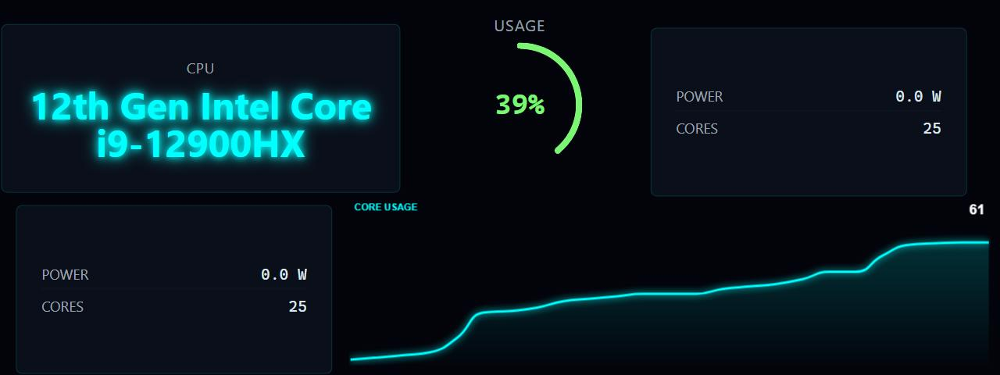

# LCDPossible Page Effects

Page effects are animated overlays that can be applied to any panel to add visual flair. Effects run in real-time and are rendered on top of or behind the panel content.

**Related Documentation:**
- [Panels](../panels/README.md) - Available display panels
- [Themes](../themes/README.md) - Color themes and customization

## Effect Gallery

Screenshots showing the `cpu-info` panel with various effects applied:

### No Effect (Baseline)


### Background Effects

| Aurora | Matrix Rain | Scanlines |
|--------|-------------|-----------|
|  |  |  |

| Hologram | Rain | Snow |
|----------|------|------|
|  |  |  |

| Particle Field | Confetti |
|----------------|----------|
|  |  |

### Overlay Effects

| VHS Static | Film Grain | Neon Border |
|------------|------------|-------------|
|  |  |  |

### Container Animation Effects

| Bounce |
|--------|
|  |

## Using Effects

### List Available Effects

```bash
# List all effects with descriptions (grouped by category)
lcdpossible config list-effects
```

### Set Default Effect

```bash
# Set effect for all panels
lcdpossible config set-effect hologram
```

### Apply Effect to Panel

```bash
# Apply effect using pipe syntax (note: quotes required)
lcdpossible show "cpu-status|@effect=matrix-rain"

# Multiple modifiers
lcdpossible show "cpu-status|@effect=scanlines|@theme=cyberpunk"

# In profile YAML
panels:
  - type: cpu-status
    effect: aurora
    theme: cyberpunk
```

### Random Effect

```bash
# Apply random effect (re-randomizes each time panel is shown)
lcdpossible show "cpu-status|@effect=random"
```

## Effect Categories

### Container Animation Effects

Effects that animate the panel widgets/containers.

| Effect | Description |
|--------|-------------|
| `gentle-float` | Containers float up/down subtly (breathing effect) |
| `tilt-3d` | Containers have slight 3D tilt/perspective that shifts |
| `bounce` | Widgets bounce around with physics, bouncing off walls |
| `wave` | Widgets wave in a sine pattern across the grid |

### Background Effects

Animated backgrounds that render behind the panel content.

> **Tip:** Run `lcdpossible config list-effects` to see the current list of all effects with descriptions.

| Effect | Description |
|--------|-------------|
| `aurora` | Northern lights with flowing color ribbons |
| `bokeh` | Out-of-focus light circles drifting |
| `breathing-glow` | Pulsing ambient glow around edges |
| `bubbles` | Translucent bubbles floating upward |
| `clouds` | Slow-moving clouds drifting across |
| `confetti` | Colorful confetti falling continuously |
| `embers` | Glowing embers floating upward |
| `fireflies` | Glowing particles drifting randomly |
| `fireworks` | Colorful fireworks exploding in the background |
| `grid-pulse` | Grid lines pulse outward from center |
| `hologram` | Holographic shimmer/interference pattern |
| `lava-lamp` | Blobby colored blobs floating |
| `lightning` | Occasional lightning flashes across background |
| `matrix-rain` | Digital rain falling behind widgets |
| `particle-field` | Floating particles in the background |
| `rain` | Rain drops falling with splash effects |
| `scanlines` | CRT/retro scanline overlay |
| `smoke` | Wispy smoke tendrils rising |
| `snow` | Gentle snowflakes drifting down |
| `stars-twinkle` | Stationary twinkling starfield |
| `waves` | Ocean waves flowing at bottom |

### Overlay Effects

Effects that render on top of panel content for post-processing looks.

| Effect | Description |
|--------|-------------|
| `vhs-static` | VHS tape noise/tracking lines |
| `film-grain` | Old film grain texture with scratches |
| `lens-flare` | Moving lens flare effect |
| `neon-border` | Glowing pulse around widget edges |
| `chromatic-aberration` | RGB split/shift effect at edges |
| `crt-warp` | CRT screen edge warping/vignette |

### Character/Mascot Effects

Animated characters that interact with the panel content.

| Effect | Description |
|--------|-------------|
| `vanna-white` | Character walks up to tiles and gestures at them |
| `pixel-mascot` | Retro pixel character reacts to values |
| `robot-assistant` | Cute robot points at important metrics |

### Alert/Status Effects

Effects triggered by panel state or data values.

| Effect | Description |
|--------|-------------|
| `spotlight` | Roaming spotlight illuminates different widgets |

## Effect Details

### aurora

Northern lights effect with flowing color ribbons across the screen.

- **Category:** Background
- **Performance:** Medium (canvas animation)
- **Best with:** Dark themes, space/tech panels

### matrix-rain

Digital rain effect inspired by The Matrix. Green characters fall from top to bottom.

- **Category:** Background
- **Performance:** Medium (canvas animation)
- **Best with:** Cyberpunk theme, system monitoring panels

### scanlines

Classic CRT scanline overlay for a retro computing aesthetic.

- **Category:** Background
- **Performance:** Low (CSS only)
- **Best with:** Any dark theme, retro look

### vhs-static

VHS tape playback simulation with static noise, tracking lines, and occasional tears.

- **Category:** Overlay
- **Performance:** Medium (canvas animation)
- **Best with:** Retro themes, video panels

### film-grain

Old film grain texture with scratches and dust spots for a vintage cinema look.

- **Category:** Overlay
- **Performance:** Medium (canvas animation)
- **Best with:** Any theme, adds texture

### chromatic-aberration

RGB color channel separation effect at screen edges, simulating lens distortion.

- **Category:** Overlay
- **Performance:** Low (CSS transforms)
- **Best with:** Cyberpunk theme, tech panels

### lava-lamp

Colorful blobs that float and merge like a lava lamp.

- **Category:** Background
- **Performance:** Medium (canvas animation)
- **Best with:** RGB gaming theme, casual displays

### confetti

Celebratory confetti particles falling continuously.

- **Category:** Background
- **Performance:** Medium (canvas animation)
- **Best with:** Achievement displays, celebrations

---

*[Back to Documentation](../README.md)*
