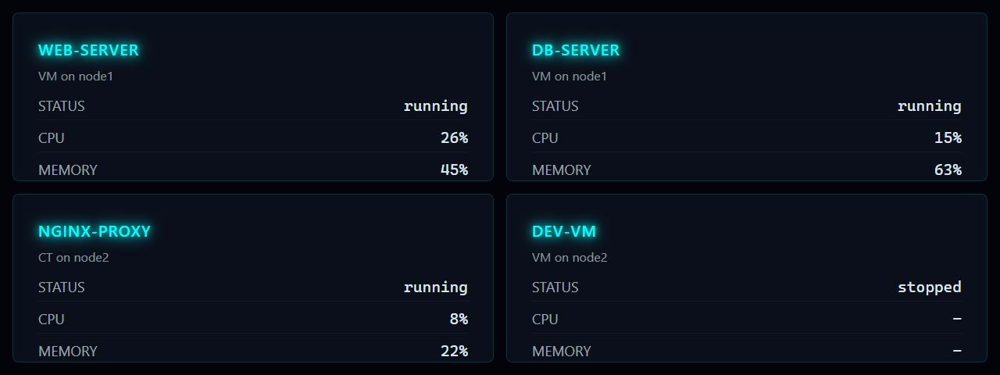

# Proxmox VMs

**Panel ID:** `proxmox-vms`
**Category:** Proxmox
**Plugin:** Proxmox VE Panels
**Live Data:** Yes
**Animated:** No

List of VMs and containers with status and resource usage

## Screenshot



## Details

Displays a list of VMs and containers in your Proxmox cluster:
- VM/Container name and ID
- Running status (running, stopped, paused)
- CPU and RAM usage per VM
- Node location

Requires Proxmox API configuration in your profile:
  proxmox:
    host: https://pve.example.com:8006
    username: root@pam
    token_id: monitor
    token_secret: xxxx-xxxx-xxxx

The list auto-scrolls if there are more VMs than fit on screen.

## Examples
### Display VM/Container list

```bash
lcdpossible show proxmox-vms
```
### Update VM status every 15 seconds

```bash
lcdpossible show proxmox-vms|@interval=15
```

## Profile Usage

### Add to Profile

```bash
# Add panel to default profile
lcdpossible profile append-panel proxmox-vms

# Add with custom duration (30 seconds)
lcdpossible profile append-panel "proxmox-vms|@duration=30"
```

### Quick Show

```bash
# Display panel immediately
lcdpossible show proxmox-vms
```

---

*Generated by [LCDPossible](https://github.com/DevPossible/lcd-possible)*
