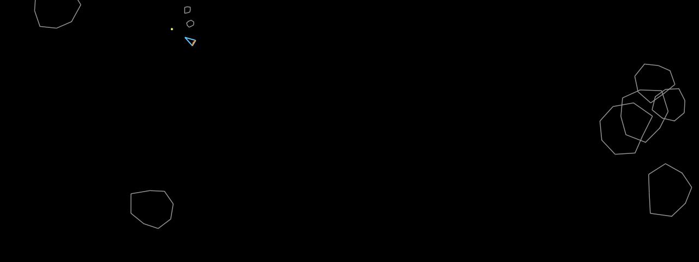

# Asteroids

**Panel ID:** `asteroids`
**Category:** Screensaver
**Plugin:** Screensaver Panels
**Live Data:** Yes
**Animated:** Yes

Asteroids game simulation with vector graphics

## Screenshot



## Details

Classic Asteroids arcade game simulation.

Features:
- AI-controlled ship
- Vector-style graphics
- Asteroid splitting physics
- Auto-play demonstration

Watch an AI pilot play the classic arcade game.

## Examples

### Display Asteroids simulation

```bash
lcdpossible show asteroids
```


## Profile Usage

### Add to Profile

```bash
# Add panel to default profile
lcdpossible profile append-panel asteroids

# Add with custom duration (30 seconds)
lcdpossible profile append-panel "asteroids|@duration=30"
```

### Quick Show

```bash
# Display panel immediately
lcdpossible show asteroids
```

---

*Generated by [LCDPossible](https://github.com/DevPossible/lcd-possible)*
