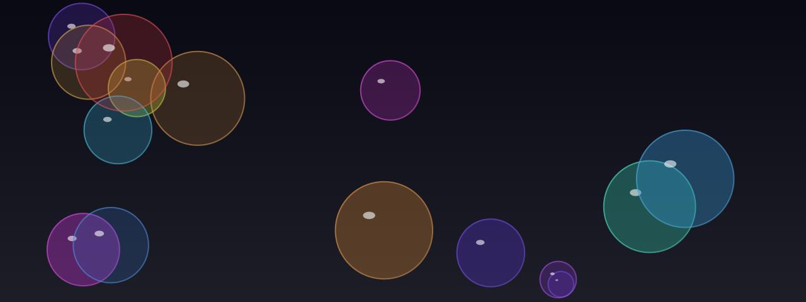

# Bubbles

**Panel ID:** `bubbles`
**Category:** Screensaver
**Plugin:** Screensaver Panels
**Live Data:** Yes
**Animated:** Yes

Floating, bouncing translucent bubbles

## Screenshot



## Details

Colorful translucent bubbles floating around.

Features:
- Various bubble sizes
- Soft reflections and highlights
- Gentle floating motion
- Translucent overlapping

A relaxing, calming visual effect.

## Examples

### Display floating bubbles

```bash
lcdpossible show bubbles
```


## Profile Usage

### Add to Profile

```bash
# Add panel to default profile
lcdpossible profile append-panel bubbles

# Add with custom duration (30 seconds)
lcdpossible profile append-panel "bubbles|@duration=30"
```

### Quick Show

```bash
# Display panel immediately
lcdpossible show bubbles
```

---

*Generated by [LCDPossible](https://github.com/DevPossible/lcd-possible)*
