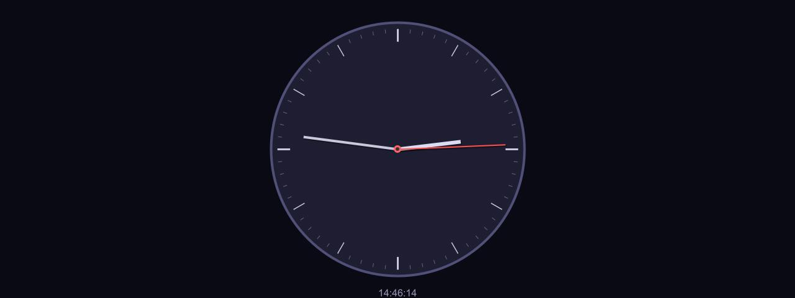

# Analog Clock

**Panel ID:** `clock`
**Category:** Screensaver
**Plugin:** Screensaver Panels
**Live Data:** Yes
**Animated:** Yes

Analog clock with smooth second hand

## Screenshot



## Details

Classic analog clock display.

Features:
- Hour, minute, and second hands
- Smooth second hand animation
- Clean, minimal design
- Accurate system time

A functional and elegant screensaver.

## Examples

### Display analog clock

```bash
lcdpossible show clock
```


## Profile Usage

### Add to Profile

```bash
# Add panel to default profile
lcdpossible profile append-panel clock

# Add with custom duration (30 seconds)
lcdpossible profile append-panel "clock|@duration=30"
```

### Quick Show

```bash
# Display panel immediately
lcdpossible show clock
```

---

*Generated by [LCDPossible](https://github.com/DevPossible/lcd-possible)*
