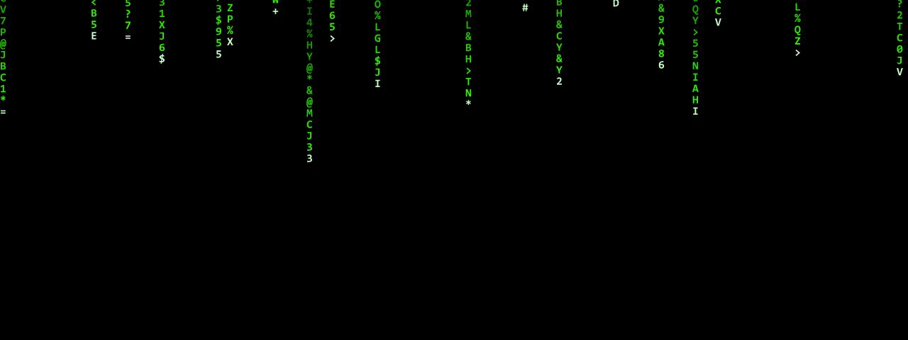

# Matrix Rain

**Panel ID:** `matrix-rain`
**Category:** Screensaver
**Plugin:** Screensaver Panels
**Live Data:** Yes
**Animated:** Yes

Digital rain effect inspired by The Matrix

## Screenshot



## Details

Green digital rain cascading down the screen.

Features:
- Random katakana and ASCII characters
- Glowing lead characters
- Fading trails
- Variable speed columns

Inspired by the iconic visual from The Matrix films.

## Examples

### Display Matrix rain effect

```bash
lcdpossible show matrix-rain
```


## Profile Usage

### Add to Profile

```bash
# Add panel to default profile
lcdpossible profile append-panel matrix-rain

# Add with custom duration (30 seconds)
lcdpossible profile append-panel "matrix-rain|@duration=30"
```

### Quick Show

```bash
# Display panel immediately
lcdpossible show matrix-rain
```

---

*Generated by [LCDPossible](https://github.com/DevPossible/lcd-possible)*
