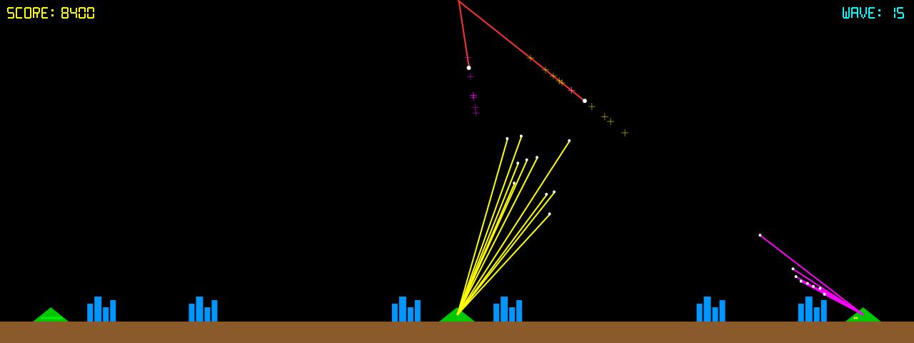

# Missile Command

**Panel ID:** `missile-command`
**Category:** Screensaver
**Plugin:** Screensaver Panels
**Live Data:** Yes
**Animated:** Yes

Defend cities from incoming missiles

## Screenshot



## Details

Classic Missile Command arcade game simulation.

Features:
- AI-controlled defense
- Incoming missiles and MIRVs
- Explosion effects
- City defense gameplay

Watch an AI defend the cities from nuclear attack.

## Examples

### Display Missile Command simulation

```bash
lcdpossible show missile-command
```


## Profile Usage

### Add to Profile

```bash
# Add panel to default profile
lcdpossible profile append-panel missile-command

# Add with custom duration (30 seconds)
lcdpossible profile append-panel "missile-command|@duration=30"
```

### Quick Show

```bash
# Display panel immediately
lcdpossible show missile-command
```

---

*Generated by [LCDPossible](https://github.com/DevPossible/lcd-possible)*
