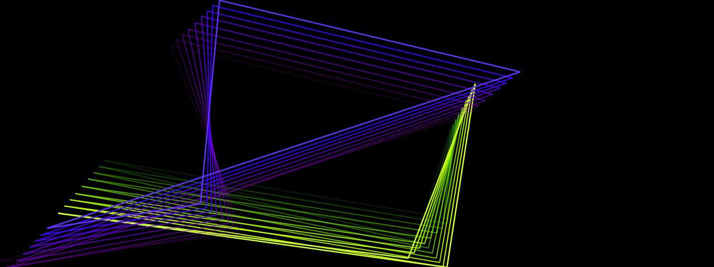

# Mystify

**Panel ID:** `mystify`
**Category:** Screensaver
**Plugin:** Screensaver Panels
**Live Data:** Yes
**Animated:** Yes

Bouncing connected polygons with color trails

## Screenshot



## Details

Classic Windows Mystify screensaver recreation.

Features:
- Two connected polygon shapes
- Vertices bounce independently
- Rainbow color cycling
- Smooth trailing effect

A faithful recreation of the classic Windows 3.1/95 screensaver.

## Examples

### Display Mystify effect

```bash
lcdpossible show mystify
```


## Profile Usage

### Add to Profile

```bash
# Add panel to default profile
lcdpossible profile append-panel mystify

# Add with custom duration (30 seconds)
lcdpossible profile append-panel "mystify|@duration=30"
```

### Quick Show

```bash
# Display panel immediately
lcdpossible show mystify
```

---

*Generated by [LCDPossible](https://github.com/DevPossible/lcd-possible)*
