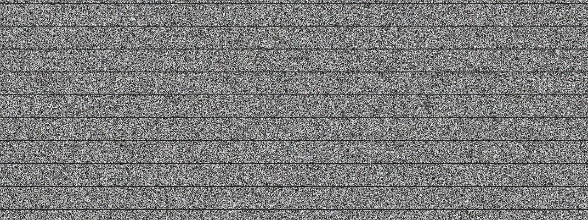

# Static

**Panel ID:** `noise`
**Category:** Screensaver
**Plugin:** Screensaver Panels
**Live Data:** Yes
**Animated:** Yes

TV static / white noise effect

## Screenshot



## Details

Classic TV static / snow effect.

Features:
- Random pixel noise
- Authentic analog TV look
- Subtle scan line effect
- Full-screen coverage

Reminiscent of analog TV static when no signal was present.

## Examples

### Display TV static

```bash
lcdpossible show noise
```


## Profile Usage

### Add to Profile

```bash
# Add panel to default profile
lcdpossible profile append-panel noise

# Add with custom duration (30 seconds)
lcdpossible profile append-panel "noise|@duration=30"
```

### Quick Show

```bash
# Display panel immediately
lcdpossible show noise
```

---

*Generated by [LCDPossible](https://github.com/DevPossible/lcd-possible)*
