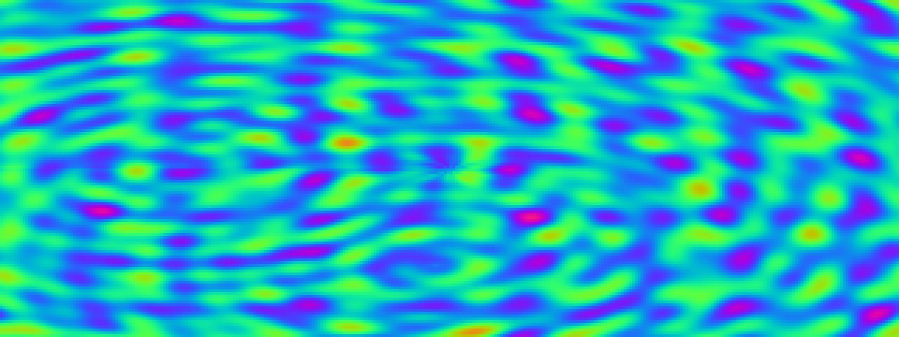

# Plasma

**Panel ID:** `plasma`
**Category:** Screensaver
**Plugin:** Screensaver Panels
**Live Data:** Yes
**Animated:** Yes

Classic demoscene plasma effect

## Screenshot



## Details

Psychedelic plasma effect from the demoscene era.

Features:
- Smooth color gradients
- Multiple overlapping sine waves
- Palette cycling animation
- Hypnotic visual patterns

A tribute to the classic demoscene visual effects of the 90s.

## Examples

### Display plasma effect

```bash
lcdpossible show plasma
```


## Profile Usage

### Add to Profile

```bash
# Add panel to default profile
lcdpossible profile append-panel plasma

# Add with custom duration (30 seconds)
lcdpossible profile append-panel "plasma|@duration=30"
```

### Quick Show

```bash
# Display panel immediately
lcdpossible show plasma
```

---

*Generated by [LCDPossible](https://github.com/DevPossible/lcd-possible)*
