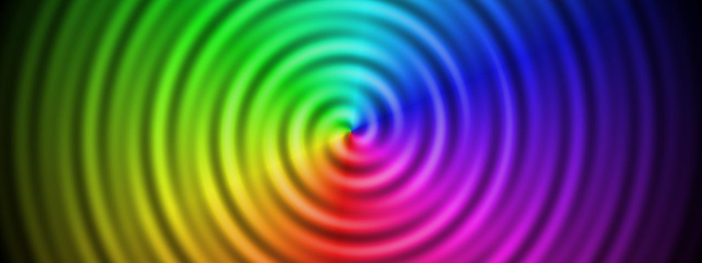

# Spiral

**Panel ID:** `spiral`
**Category:** Screensaver
**Plugin:** Screensaver Panels
**Live Data:** Yes
**Animated:** Yes

Hypnotic rotating spiral pattern

## Screenshot



## Details

Hypnotic rotating spiral pattern.

Features:
- Smooth rotation animation
- Alternating color bands
- Creates optical illusion
- Adjustable speed

Warning: May be hypnotic. Not recommended for extended viewing.

## Examples

### Display spiral effect

```bash
lcdpossible show spiral
```


## Profile Usage

### Add to Profile

```bash
# Add panel to default profile
lcdpossible profile append-panel spiral

# Add with custom duration (30 seconds)
lcdpossible profile append-panel "spiral|@duration=30"
```

### Quick Show

```bash
# Display panel immediately
lcdpossible show spiral
```

---

*Generated by [LCDPossible](https://github.com/DevPossible/lcd-possible)*
