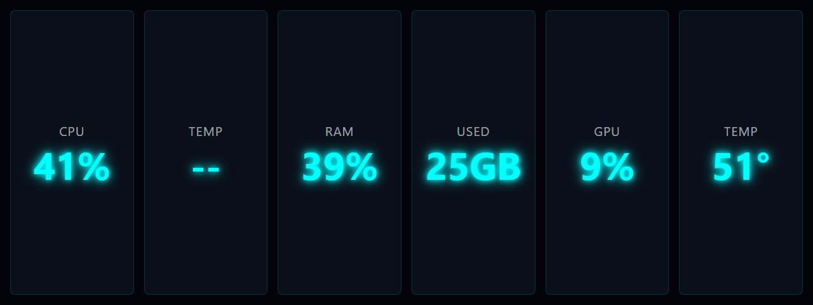

# Basic Usage Text

**Panel ID:** `basic-usage-text`
**Category:** System
**Plugin:** LCDPossible Core Panels
**Live Data:** Yes
**Animated:** No

Simple CPU/RAM/GPU usage summary

## Screenshot



## Details

Shows a compact summary of system resource usage:
- CPU usage percentage
- RAM usage percentage
- GPU usage percentage

All values displayed on a single panel for quick overview.

## Dependencies
- LibreHardwareMonitorLib


## Examples
### Display combined CPU/RAM/GPU usage

```bash
lcdpossible show basic-usage-text
```

## Profile Usage

### Add to Profile

```bash
# Add panel to default profile
lcdpossible profile append-panel basic-usage-text

# Add with custom duration (30 seconds)
lcdpossible profile append-panel "basic-usage-text|@duration=30"
```

### Quick Show

```bash
# Display panel immediately
lcdpossible show basic-usage-text
```

---

*Generated by [LCDPossible](https://github.com/DevPossible/lcd-possible)*

*[Back to Panels](../README.md)*
