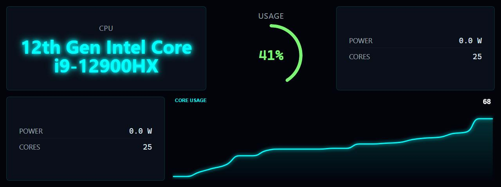

# CPU Info

**Panel ID:** `cpu-info`
**Category:** CPU
**Plugin:** LCDPossible Core Panels
**Live Data:** Yes
**Animated:** No

Detailed CPU information including model, usage, temperature, frequency, and power

## Screenshot



## Details

Displays comprehensive CPU information in a formatted layout:
- CPU model name and architecture
- Current usage percentage
- Temperature (if sensors available)
- Clock frequency
- Power consumption (if available)

Requires LibreHardwareMonitor for Windows sensor data.

## Dependencies
- LibreHardwareMonitorLib


## Examples
### Display CPU information panel

```bash
lcdpossible show cpu-info
```
### Display CPU info for 30 seconds

```bash
lcdpossible show cpu-info|@duration=30
```

## Profile Usage

### Add to Profile

```bash
# Add panel to default profile
lcdpossible profile append-panel cpu-info

# Add with custom duration (30 seconds)
lcdpossible profile append-panel "cpu-info|@duration=30"
```

### Quick Show

```bash
# Display panel immediately
lcdpossible show cpu-info
```

---

*Generated by [LCDPossible](https://github.com/DevPossible/lcd-possible)*

*[Back to Panels](../README.md)*
