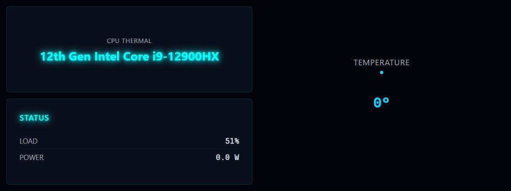

# CPU Thermal

**Panel ID:** `cpu-thermal-graphic`
**Category:** Thermal
**Plugin:** LCDPossible Core Panels
**Live Data:** Yes
**Animated:** No

CPU temperature with graphical gauge display

## Screenshot



## Details

Displays CPU temperature as a visual gauge:
- Thermometer-style visualization
- Current temperature value
- Color-coded (green/yellow/red) based on temperature
- Min/Max indicators if available

## Dependencies
- LibreHardwareMonitorLib


## Examples
### Display CPU temperature gauge

```bash
lcdpossible show cpu-thermal-graphic
```

## Profile Usage

### Add to Profile

```bash
# Add panel to default profile
lcdpossible profile append-panel cpu-thermal-graphic

# Add with custom duration (30 seconds)
lcdpossible profile append-panel "cpu-thermal-graphic|@duration=30"
```

### Quick Show

```bash
# Display panel immediately
lcdpossible show cpu-thermal-graphic
```

---

*Generated by [LCDPossible](https://github.com/DevPossible/lcd-possible)*

*[Back to Panels](../README.md)*
