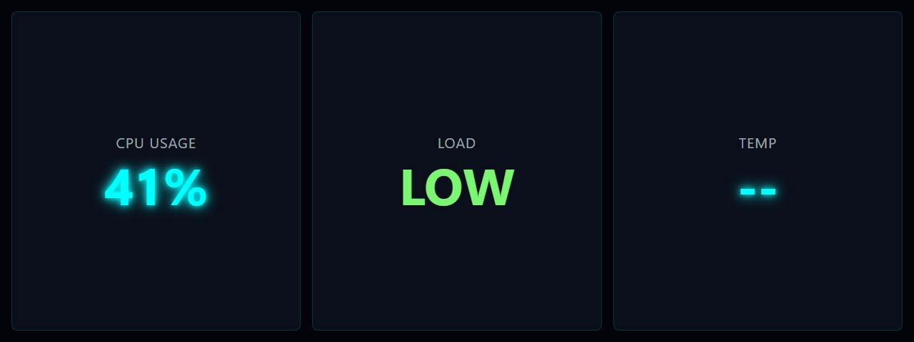

# CPU Usage Text

**Panel ID:** `cpu-usage-text`
**Category:** CPU
**Plugin:** LCDPossible Core Panels
**Live Data:** Yes
**Animated:** No

CPU usage displayed as large text percentage

## Screenshot



## Details

Shows CPU usage as a large, easy-to-read percentage number.
Ideal for at-a-glance monitoring when detailed info isn't needed.

The text scales to fill the display for maximum visibility.

## Dependencies
- LibreHardwareMonitorLib


## Examples
### Display CPU usage as large text

```bash
lcdpossible show cpu-usage-text
```

## Profile Usage

### Add to Profile

```bash
# Add panel to default profile
lcdpossible profile append-panel cpu-usage-text

# Add with custom duration (30 seconds)
lcdpossible profile append-panel "cpu-usage-text|@duration=30"
```

### Quick Show

```bash
# Display panel immediately
lcdpossible show cpu-usage-text
```

---

*Generated by [LCDPossible](https://github.com/DevPossible/lcd-possible)*

*[Back to Panels](../README.md)*
