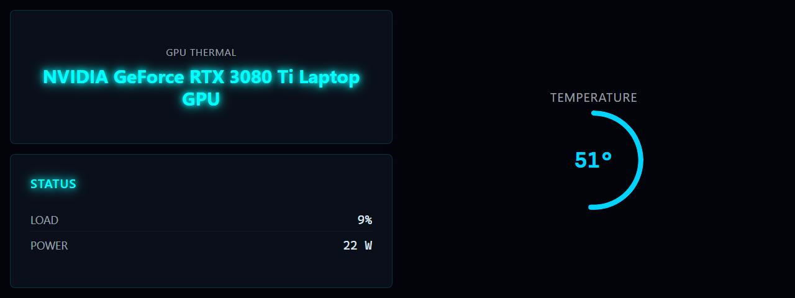

# GPU Thermal

**Panel ID:** `gpu-thermal-graphic`
**Category:** Thermal
**Plugin:** LCDPossible Core Panels
**Live Data:** Yes
**Animated:** No

GPU temperature with graphical gauge display

## Screenshot



## Details

Displays GPU temperature as a visual gauge:
- Thermometer-style visualization
- Current temperature value
- Color-coded based on temperature
- Useful for monitoring during gaming/rendering

## Dependencies
- LibreHardwareMonitorLib


## Examples
### Display GPU temperature gauge

```bash
lcdpossible show gpu-thermal-graphic
```

## Profile Usage

### Add to Profile

```bash
# Add panel to default profile
lcdpossible profile append-panel gpu-thermal-graphic

# Add with custom duration (30 seconds)
lcdpossible profile append-panel "gpu-thermal-graphic|@duration=30"
```

### Quick Show

```bash
# Display panel immediately
lcdpossible show gpu-thermal-graphic
```

---

*Generated by [LCDPossible](https://github.com/DevPossible/lcd-possible)*

*[Back to Panels](../README.md)*
