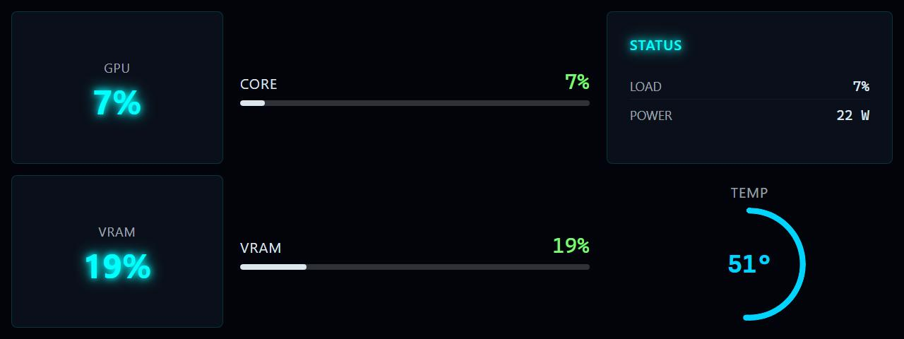

# GPU Usage Graphic

**Panel ID:** `gpu-usage-graphic`
**Category:** GPU
**Plugin:** LCDPossible Core Panels
**Live Data:** Yes
**Animated:** No

GPU usage with graphical bars

## Screenshot



## Details

Displays GPU usage with visual progress bars:
- GPU core usage bar
- VRAM usage bar
- Temperature indicator
- Percentage labels

Color-coded bars indicate load level.

## Dependencies
- LibreHardwareMonitorLib


## Examples
### Display GPU usage with graphical bars

```bash
lcdpossible show gpu-usage-graphic
```

## Profile Usage

### Add to Profile

```bash
# Add panel to default profile
lcdpossible profile append-panel gpu-usage-graphic

# Add with custom duration (30 seconds)
lcdpossible profile append-panel "gpu-usage-graphic|@duration=30"
```

### Quick Show

```bash
# Display panel immediately
lcdpossible show gpu-usage-graphic
```

---

*Generated by [LCDPossible](https://github.com/DevPossible/lcd-possible)*

*[Back to Panels](../README.md)*
