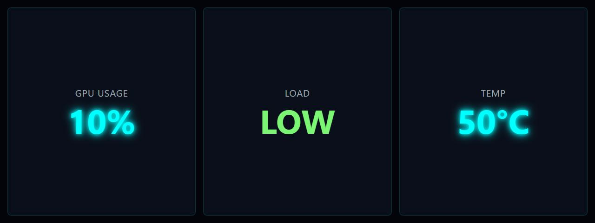

# GPU Usage Text

**Panel ID:** `gpu-usage-text`
**Category:** GPU
**Plugin:** LCDPossible Core Panels
**Live Data:** Yes
**Animated:** No

GPU usage displayed as large text

## Screenshot



## Details

Shows GPU usage as a large, easy-to-read percentage.
Ideal for monitoring GPU load during gaming or rendering.

## Dependencies
- LibreHardwareMonitorLib


## Examples
### Display GPU usage as large text

```bash
lcdpossible show gpu-usage-text
```

## Profile Usage

### Add to Profile

```bash
# Add panel to default profile
lcdpossible profile append-panel gpu-usage-text

# Add with custom duration (30 seconds)
lcdpossible profile append-panel "gpu-usage-text|@duration=30"
```

### Quick Show

```bash
# Display panel immediately
lcdpossible show gpu-usage-text
```

---

*Generated by [LCDPossible](https://github.com/DevPossible/lcd-possible)*

*[Back to Panels](../README.md)*
