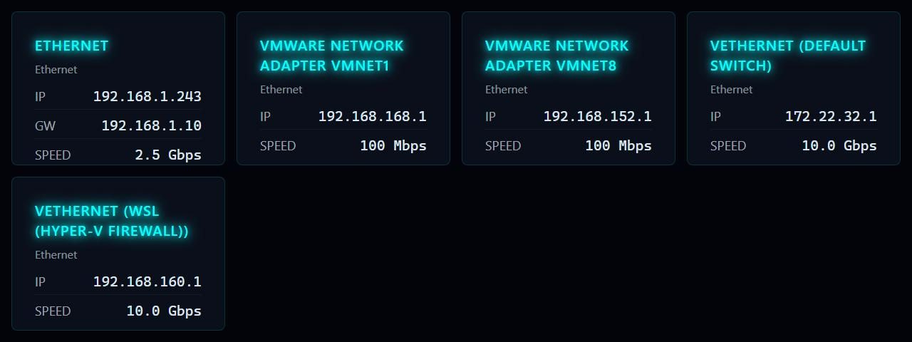

# Network Info

**Panel ID:** `network-info`
**Category:** Network
**Plugin:** LCDPossible Core Panels
**Live Data:** Yes
**Animated:** No

Network interfaces with IP addresses, gateway, MAC, and link speed

## Screenshot



## Details

Displays active network interfaces using responsive HTML widgets:
- Interface name and type (Ethernet, WiFi)
- IP address and subnet mask
- Default gateway
- Link speed (Mbps/Gbps)
- MAC address

Layout adapts automatically based on number of interfaces (1-4).
Works on all platforms.

## Dependencies
- PuppeteerSharp


## Examples
### Display network interfaces

```bash
lcdpossible show network-info
```

## Profile Usage

### Add to Profile

```bash
# Add panel to default profile
lcdpossible profile append-panel network-info

# Add with custom duration (30 seconds)
lcdpossible profile append-panel "network-info|@duration=30"
```

### Quick Show

```bash
# Display panel immediately
lcdpossible show network-info
```

---

*Generated by [LCDPossible](https://github.com/DevPossible/lcd-possible)*

*[Back to Panels](../README.md)*
