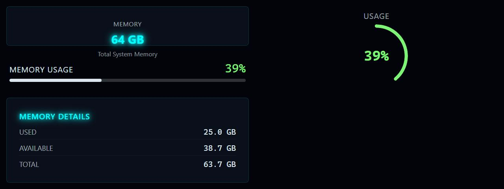

# RAM Info

**Panel ID:** `ram-info`
**Category:** Memory
**Plugin:** LCDPossible Core Panels
**Live Data:** Yes
**Animated:** No

Memory information including total, used, and available

## Screenshot



## Details

Shows detailed memory information:
- Total physical RAM
- Used memory
- Available memory
- Usage percentage
- Memory type/speed (if available)

## Dependencies
- LibreHardwareMonitorLib


## Examples
### Display RAM information

```bash
lcdpossible show ram-info
```

## Profile Usage

### Add to Profile

```bash
# Add panel to default profile
lcdpossible profile append-panel ram-info

# Add with custom duration (30 seconds)
lcdpossible profile append-panel "ram-info|@duration=30"
```

### Quick Show

```bash
# Display panel immediately
lcdpossible show ram-info
```

---

*Generated by [LCDPossible](https://github.com/DevPossible/lcd-possible)*

*[Back to Panels](../README.md)*
