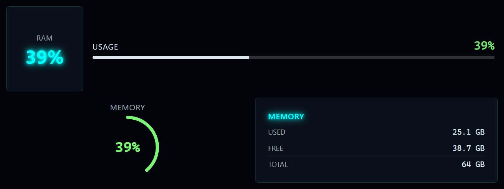

# RAM Usage Graphic

**Panel ID:** `ram-usage-graphic`
**Category:** Memory
**Plugin:** LCDPossible Core Panels
**Live Data:** Yes
**Animated:** No

RAM usage with graphical bar

## Screenshot



## Details

Displays memory usage with a visual progress bar:
- Large progress bar showing used vs total
- Percentage label
- Used/Total values in GB
- Color changes based on usage level

## Dependencies
- LibreHardwareMonitorLib


## Examples
### Display RAM usage with graphical bar

```bash
lcdpossible show ram-usage-graphic
```

## Profile Usage

### Add to Profile

```bash
# Add panel to default profile
lcdpossible profile append-panel ram-usage-graphic

# Add with custom duration (30 seconds)
lcdpossible profile append-panel "ram-usage-graphic|@duration=30"
```

### Quick Show

```bash
# Display panel immediately
lcdpossible show ram-usage-graphic
```

---

*Generated by [LCDPossible](https://github.com/DevPossible/lcd-possible)*

*[Back to Panels](../README.md)*
