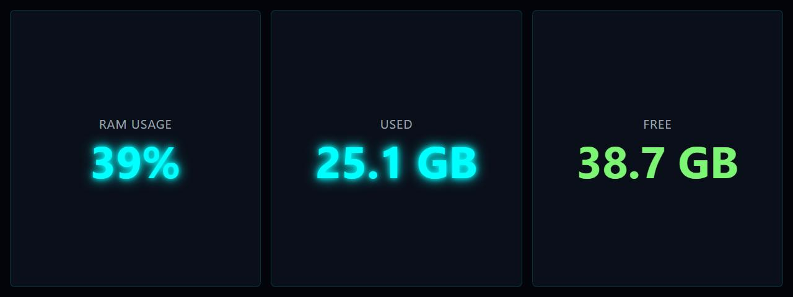

# RAM Usage Text

**Panel ID:** `ram-usage-text`
**Category:** Memory
**Plugin:** LCDPossible Core Panels
**Live Data:** Yes
**Animated:** No

RAM usage displayed as large text

## Screenshot



## Details

Shows memory usage as a large, easy-to-read percentage.
Ideal for quick visibility of memory pressure.

## Dependencies
- LibreHardwareMonitorLib


## Examples
### Display RAM usage as large text

```bash
lcdpossible show ram-usage-text
```

## Profile Usage

### Add to Profile

```bash
# Add panel to default profile
lcdpossible profile append-panel ram-usage-text

# Add with custom duration (30 seconds)
lcdpossible profile append-panel "ram-usage-text|@duration=30"
```

### Quick Show

```bash
# Display panel immediately
lcdpossible show ram-usage-text
```

---

*Generated by [LCDPossible](https://github.com/DevPossible/lcd-possible)*

*[Back to Panels](../README.md)*
