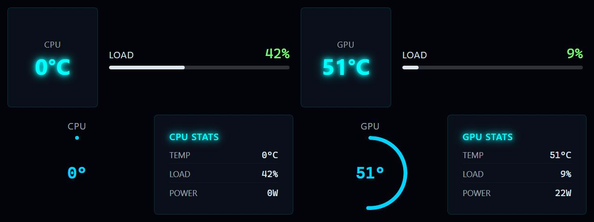

# System Thermal

**Panel ID:** `system-thermal-graphic`
**Category:** Thermal
**Plugin:** LCDPossible Core Panels
**Live Data:** Yes
**Animated:** No

Combined CPU and GPU temperature display with vertical thermometers

## Screenshot



## Details

Shows both CPU and GPU temperatures side-by-side:
- Two vertical thermometer displays
- CPU temperature on left
- GPU temperature on right
- Color-coded based on temperature levels

Ideal for monitoring thermal performance during intensive tasks.

## Dependencies
- LibreHardwareMonitorLib


## Examples
### Display CPU and GPU temperatures together

```bash
lcdpossible show system-thermal-graphic
```

## Profile Usage

### Add to Profile

```bash
# Add panel to default profile
lcdpossible profile append-panel system-thermal-graphic

# Add with custom duration (30 seconds)
lcdpossible profile append-panel "system-thermal-graphic|@duration=30"
```

### Quick Show

```bash
# Display panel immediately
lcdpossible show system-thermal-graphic
```

---

*Generated by [LCDPossible](https://github.com/DevPossible/lcd-possible)*

*[Back to Panels](../README.md)*
