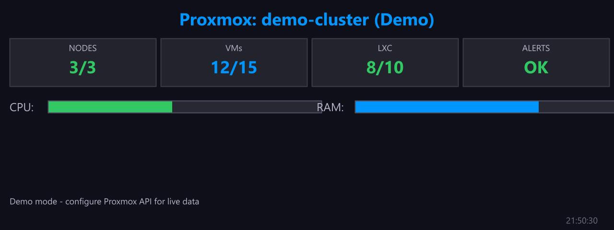

# Proxmox Summary

**Panel ID:** `proxmox-summary`
**Category:** Proxmox
**Plugin:** Proxmox VE Panels
**Live Data:** Yes
**Animated:** No

Proxmox cluster overview with node status and resource usage

## Overview

The LCDPossible panel serves as an indispenerable instrument within Proxmox infrastructure by providing administrators with a clear and concise summary of cluster status; it enables efficient monitoring of node health, resource allocation, and virtualization footprints across the networked environment. As such, this application is quintessential for maintaining optimal operational efficiency and ensuring informed decision-making within Proxmox deployments.

## Screenshot



## Details

Displays a summary of your Proxmox VE cluster:
- Cluster name and status
- Node count and health
- Total CPU/RAM usage across cluster
- Storage usage summary
- VM/Container counts

Requires Proxmox API configuration in your profile:
  proxmox:
    host: https://pve.example.com:8006
    username: root@pam
    token_id: monitor
    token_secret: xxxx-xxxx-xxxx

Tip: Create an API token with minimal read-only permissions for security.

## Examples

### Display Proxmox cluster summary

```bash
lcdpossible show proxmox-summary
```

### Update cluster status every 30 seconds

```bash
lcdpossible show proxmox-summary|@interval=30
```

### Cycle between summary and VM list

```bash
lcdpossible show proxmox-summary,proxmox-vms
```


## Profile Usage

### Add to Profile

```bash
# Add panel to default profile
lcdpossible profile append-panel proxmox-summary

# Add with custom duration (30 seconds)
lcdpossible profile append-panel "proxmox-summary|@duration=30"
```

### Quick Show

```bash
# Display panel immediately
lcdpossible show proxmox-summary
```

---

*Generated by [LCDPossible](https://github.com/DevPossible/lcd-possible)*

