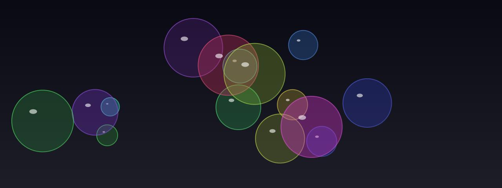

# Bubbles

**Panel ID:** `bubbles`
**Category:** Screensaver
**Plugin:** Screensaver Panels
**Live Data:** Yes
**Animated:** Yes

Floating, bouncing translucent bubbles

## Overview

The LCDPossible bubbles screensaver serves as an interactive visual enhancement designed to provide users with a calming and visually engaging experience by displaying floating translucent colored bubbles within the display area. This feature is particularly suited for personalized digital signage, virtual backgrounds during video calls, or simply unwinding after work hours when using compatible LCD displays. Its core capabilities include customizable bubble sizes with soft reflections and highlight effects that simulate gentle floating motion alongside subtle translucent overlapping to create an immersive ambiance without disrupting the user's primary tasks on-screen.

## Screenshot



## Details

Colorful translucent bubbles floating around.

Features:
- Various bubble sizes
- Soft reflections and highlights
- Gentle floating motion
- Translucent overlapping

A relaxing, calming visual effect.

## Examples

### Display floating bubbles

```bash
lcdpossible show bubbles
```


## Profile Usage

### Add to Profile

```bash
# Add panel to default profile
lcdpossible profile append-panel bubbles

# Add with custom duration (30 seconds)
lcdpossible profile append-panel "bubbles|@duration=30"
```

### Quick Show

```bash
# Display panel immediately
lcdpossible show bubbles
```

---

*Generated by [LCDPossible](https://github.com/LCDPossible/LCDPossible)*

