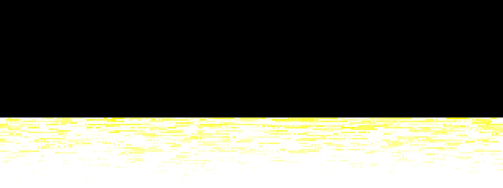

# Fire

**Panel ID:** `fire`
**Category:** Screensaver
**Plugin:** Screensaver Panels
**Live Data:** Yes
**Animated:** Yes

Classic demoscene fire effect with palette animation

## Overview

The LCDPossible Screensaver application delivers an authentic fire effect reminiscent of classic demos from the 90s demo scene through its procedural flame generation and heat-based color palette system. Designed to captivate users with dynamic visual displays, it is frequently employed as a desktop screensaver for presentations or entertainment purposes due to its realistic portrayal of fire behavior.

## Screenshot



## Details

Classic fire effect with realistic flames.

Features:
- Procedural flame generation
- Heat-based color palette
- Rising flames with cooling
- Flickering base heat source

Another classic demoscene effect, popular in the 90s demo scene.

## Examples

### Display fire effect

```bash
lcdpossible show fire
```


## Profile Usage

### Add to Profile

```bash
# Add panel to default profile
lcdpossible profile append-panel fire

# Add with custom duration (30 seconds)
lcdpossible profile append-panel "fire|@duration=30"
```

### Quick Show

```bash
# Display panel immediately
lcdpossible show fire
```

---

*Generated by [LCDPossible](https://github.com/LCDPossible/LCDPossible)*

