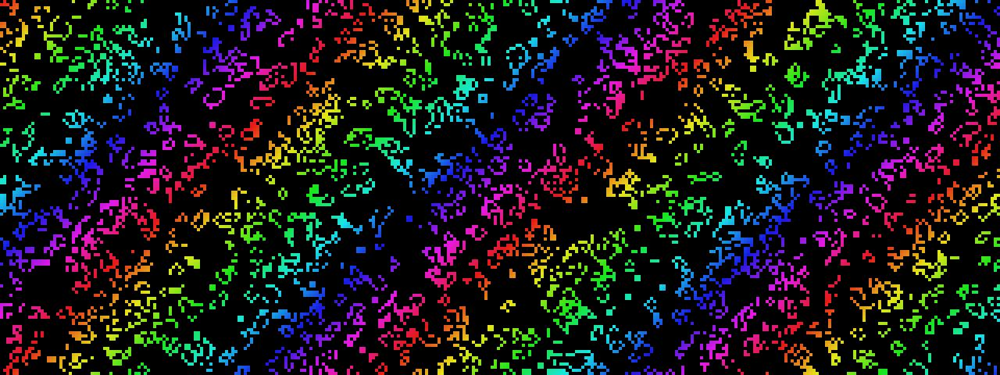

# Game of Life

**Panel ID:** `game-of-life`
**Category:** Screensaver
**Plugin:** Screensaver Panels
**Live Data:** Yes
**Animated:** Yes

Conway's cellular automaton with colorful patterns

## Overview

The LCDPossible application's 'game-of-life' panel serves as an engaging screensaver that displays Conway's Game of Life with vibrant color coding to signify cell age based on the classic B3/S23 ruleset. Users typically employ this visualizer for both educational purposes and entertainment, observing emergent patterns over time or generating random initial configurations for unpredictable artistry exploration. As a professional tool facilitating dynamic simulations of complex systems with simple computational principles, it provides an interactive experience that is not only intellectually stimulating but also accessible to a broader audience interested in the intersection of mathematics and visual arts.

## Screenshot



## Details

Conway's Game of Life cellular automaton.

Features:
- Classic B3/S23 rules
- Color-coded cell age
- Auto-reset when stable/empty
- Random pattern initialization

Watch cells live, die, and create emergent patterns.

## Examples

### Display Game of Life simulation

```bash
lcdpossible show game-of-life
```


## Profile Usage

### Add to Profile

```bash
# Add panel to default profile
lcdpossible profile add game-of-life

# Add with custom duration (30 seconds)
lcdpossible profile add "game-of-life|@duration=30"
```

### Quick Show

```bash
# Display panel immediately
lcdpossible show game-of-life
```

---

*Generated by [LCDPossible](https://github.com/DevPossible/lcd-possible)*

