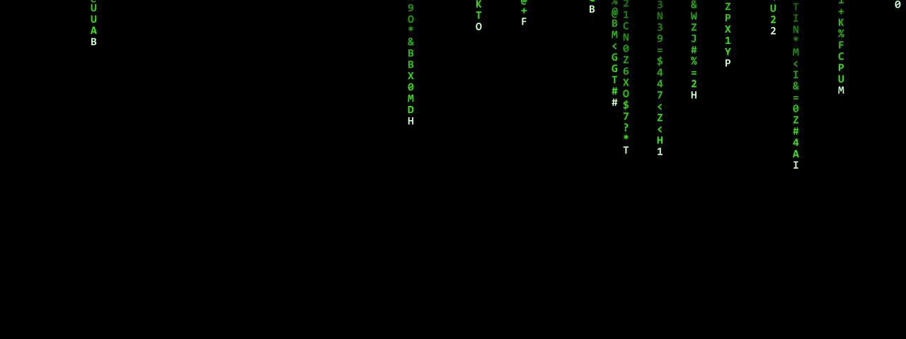

# Matrix Rain

**Panel ID:** `matrix-rain`
**Category:** Screensaver
**Plugin:** Screensaver Panels
**Live Data:** Yes
**Animated:** Yes

Digital rain effect inspired by The Matrix

## Overview

The matrix-rain panel serves as an innovative screensaver experience that emulates the digital rain effect seen in The Matrix franchise through real-time generation of random katakana and ASCII characters accompanied by glowing leads at the center for enhanced visual impact, typically utilized to safeguard display equipment from static images during prolonged periods of non-use or as an engaging desktop background.
```markdown
# Overview Section: Matrix-Rain Screensaver Panel (LCDPossible) # 
The matrix-rain panel is a professional LCD controller application designed to provide users with the iconic digital rain effect reminiscent of scenes from The Matrix films, employing real-time algorithms that produce random katakana and ASCII characters along with vibrant center leads. This screensaver not only serves as an entertaining visual backdrop but also acts to prevent static imagery on displays when equipment is idle for extended durations.

## Screenshot



## Details

Green digital rain cascading down the screen.

Features:
- Random katakana and ASCII characters
- Glowing lead characters
- Fading trails
- Variable speed columns

Inspired by the iconic visual from The Matrix films.

## Examples

### Display Matrix rain effect

```bash
lcdpossible show matrix-rain
```


## Profile Usage

### Add to Profile

```bash
# Add panel to default profile
lcdpossible profile append-panel matrix-rain

# Add with custom duration (30 seconds)
lcdpossible profile append-panel "matrix-rain|@duration=30"
```

### Quick Show

```bash
# Display panel immediately
lcdpossible show matrix-rain
```

---

*Generated by [LCDPossible](https://github.com/LCDPossible/LCDPossible)*

