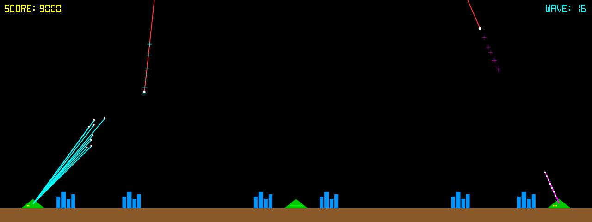

# Missile Command

**Panel ID:** `missile-command`
**Category:** Screensaver
**Plugin:** Screensaver Panels
**Live Data:** Yes
**Animated:** Yes

Defend cities from incoming missiles

## Overview

The missile-command panel serves as an interactive screensaver that simulates city defense against nuclear threats through a command center interface powered by LCDPossible's AI technology. Key capabilities include realistic management of incoming ballistic and multiple independently releasable warhead (MIRV) attacks, resulting in visually engaging explosion effects to simulate various missile impact scenarios on the city structure within the gameplay environment. This application is designed for users seeking immersive entertainment that doubles as an educational tool regarding defense strategies against modern-day threats of nuclear conflict.

## Screenshot



## Details

Classic Missile Command arcade game simulation.

Features:
- AI-controlled defense
- Incoming missiles and MIRVs
- Explosion effects
- City defense gameplay

Watch an AI defend the cities from nuclear attack.

## Examples

### Display Missile Command simulation

```bash
lcdpossible show missile-command
```


## Profile Usage

### Add to Profile

```bash
# Add panel to default profile
lcdpossible profile add missile-command

# Add with custom duration (30 seconds)
lcdpossible profile add "missile-command|@duration=30"
```

### Quick Show

```bash
# Display panel immediately
lcdpossible show missile-command
```

---

*Generated by [LCDPossible](https://github.com/DevPossible/lcd-possible)*

