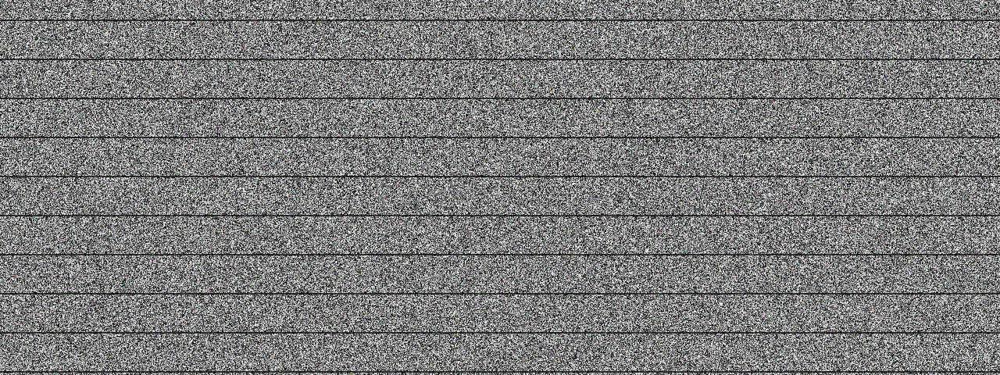

# Static

**Panel ID:** `noise`
**Category:** Screensaver
**Plugin:** Screensaver Panels
**Live Data:** Yes
**Animated:** Yes

TV static / white noise effect

## Overview

LCDPossible's 'noise' panel serves as an engaging screensaver that emulates authentic analog TV static and snow effects reminiscent of a time when signal interruption was commonplace. It provides users with full-screen coverage, introducing random pixel noise along with subtle scan line artifacts to create the illusion of incomplete or weak broadcast reception. Typically employed for its nostalgic appeal in homes that value vintage design elements or as an entertaining visual distraction on office computers during idle periods, this screensaver offers a touch of retro charm while ensuring it remains subtle and professional enough not to disrupt the work environment excessively.

## Screenshot



## Details

Classic TV static / snow effect.

Features:
- Random pixel noise
- Authentic analog TV look
- Subtle scan line effect
- Full-screen coverage

Reminiscent of analog TV static when no signal was present.

## Examples

### Display TV static

```bash
lcdpossible show noise
```


## Profile Usage

### Add to Profile

```bash
# Add panel to default profile
lcdpossible profile append-panel noise

# Add with custom duration (30 seconds)
lcdpossible profile append-panel "noise|@duration=30"
```

### Quick Show

```bash
# Display panel immediately
lcdpossible show noise
```

---

*Generated by [LCDPossible](https://github.com/LCDPossible/LCDPossible)*

