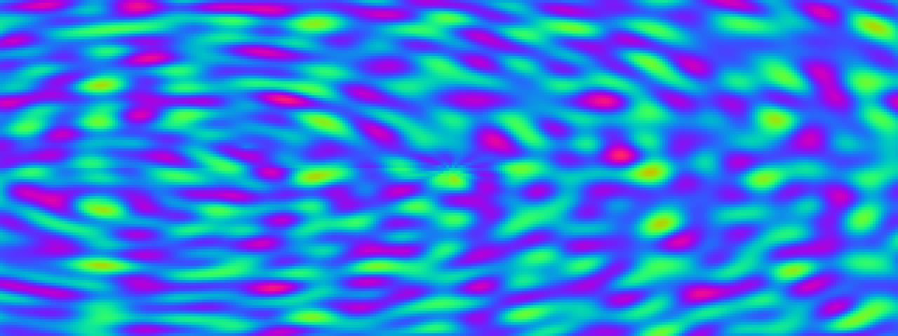

# Plasma

**Panel ID:** `plasma`
**Category:** Screensaver
**Plugin:** Screensaver Panels
**Live Data:** Yes
**Animated:** Yes

Classic demoscene plasma effect

## Overview

LCDPossible is an advanced LCD controller application designed primarily as a screensaver with functionalities reminiscent of classic demoscene plasma effects from the late '90s. It serves to captivate users through sophisticated visual patterns that employ smooth color gradients, multiple overlapping sine waves, and palette cycling animations in order to create a psychedelic experience on LCD panels typically used for professional settings or personal entertainment. The program's key capabilities are geared towards delivering high-quality screensavers that not only provide visual stimulation but also demonstrate the versatility of modern display technology when paired with creative software solutions like this one.

## Screenshot



## Details

Psychedelic plasma effect from the demoscene era.

Features:
- Smooth color gradients
- Multiple overlapping sine waves
- Palette cycling animation
- Hypnotic visual patterns

A tribute to the classic demoscene visual effects of the 90s.

## Examples

### Display plasma effect

```bash
lcdpossible show plasma
```


## Profile Usage

### Add to Profile

```bash
# Add panel to default profile
lcdpossible profile append-panel plasma

# Add with custom duration (30 seconds)
lcdpossible profile append-panel "plasma|@duration=30"
```

### Quick Show

```bash
# Display panel immediately
lcdpossible show plasma
```

---

*Generated by [LCDPossible](https://github.com/LCDPossible/LCDPossible)*

