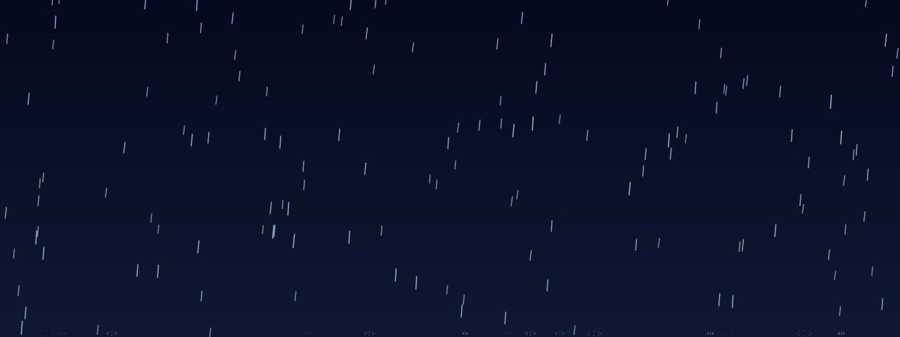

# Rain

**Panel ID:** `rain`
**Category:** Screensaver
**Plugin:** Screensaver Panels
**Live Data:** Yes
**Animated:** Yes

Falling raindrops with splash effects

## Overview

LCDPossible's Rain panel serves as an immersive screensaver experience featuring realistic falling raindrops with calming splash effects and streaking trails that mimic the natural flow of rain on a windowpane. With its atmospheric blue tint, it effectively transforms any view into a serene scene reminiscent of weather patterns during gentle showers or drizzles. This feature is widely appreciated in workplace environments for promoting relaxation and reducing stress levels among employees during their downtime within the LCDPossible ecosystem.

## Screenshot



## Details

Realistic rain falling on a window.

Features:
- Varying raindrop sizes
- Splash effects at bottom
- Streaking water trails
- Atmospheric blue tint

A calming rain visualization.

## Examples

### Display rain effect

```bash
lcdpossible show rain
```


## Profile Usage

### Add to Profile

```bash
# Add panel to default profile
lcdpossible profile append-panel rain

# Add with custom duration (30 seconds)
lcdpossible profile append-panel "rain|@duration=30"
```

### Quick Show

```bash
# Display panel immediately
lcdpossible show rain
```

---

*Generated by [LCDPossible](https://github.com/DevPossible/lcd-possible)*

