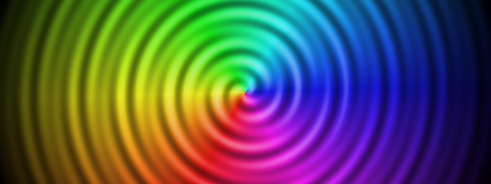

# Spiral

**Panel ID:** `spiral`
**Category:** Screensaver
**Plugin:** Screensaver Panels
**Live Data:** Yes
**Animated:** Yes

Hypnotic rotating spiral pattern

## Overview

The LCDPossible spiral screensaver is designed to serve as an engaging visual spectacle that draws users into a hypnotic rotating spiral pattern while providing smooth rotation animation and adjustable speed settings for personalized viewing experiences. Its key features, such as alternating color bands creating optical illusions and its suitability as a screensaver in professional environments aimed at visually stimulating short-term periods of rest or work breaks, are central to the product's utility. Users should exercise caution with extended exposure due to potential hypnotic effects.

## Screenshot



## Details

Hypnotic rotating spiral pattern.

Features:
- Smooth rotation animation
- Alternating color bands
- Creates optical illusion
- Adjustable speed

Warning: May be hypnotic. Not recommended for extended viewing.

## Examples

### Display spiral effect

```bash
lcdpossible show spiral
```


## Profile Usage

### Add to Profile

```bash
# Add panel to default profile
lcdpossible profile append-panel spiral

# Add with custom duration (30 seconds)
lcdpossible profile append-panel "spiral|@duration=30"
```

### Quick Show

```bash
# Display panel immediately
lcdpossible show spiral
```

---

*Generated by [LCDPossible](https://github.com/DevPossible/lcd-possible)*

